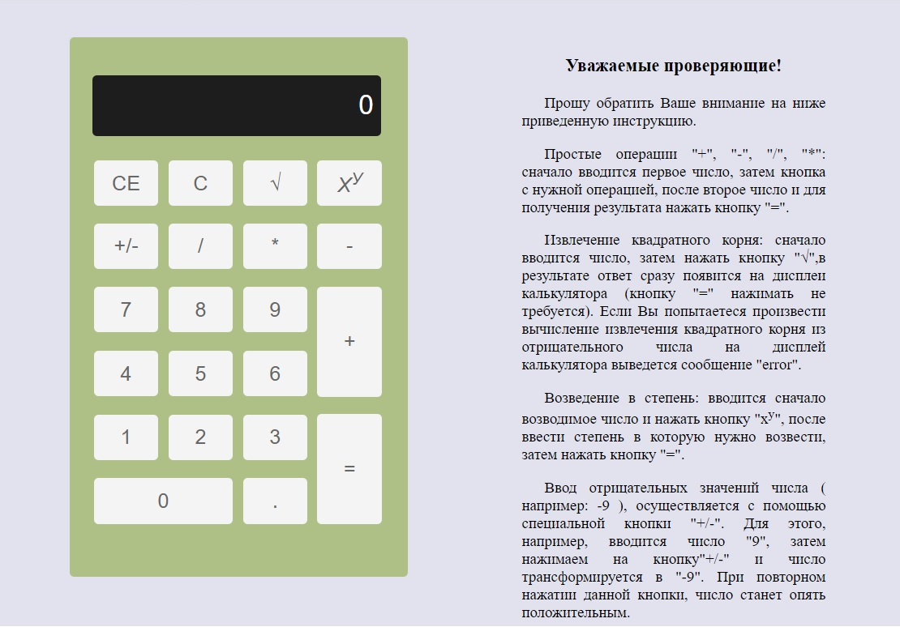

# Task 1. Calculator от [RSS School](https://rs.school/)

### **Проект Calculator [(готовый)]( https://marinatwice82.github.io/calculator/)**

### Описание

* Базовая функциональность:

    * калькулятор выполняет математические операции: сложение, вычитание, умножение, деление. Обязательно наличие десятичной точки, действия с многозначными числами, возможность выполнить несколько действий подряд, очистить результат. По сути калькулятор воспроизводит функциональность исходного проекта. Эта часть задания особых проблем доставить не должна.

* Дополнительные математические операции:

    * добавьте к четырём перечисленным в предыдущем пункте математическим операциям ещё две: извлечение квадратного корня и возведение в степень. Подсказка: если все кнопки калькулятора сделать одного размера, как раз останется место для добавления ещё двух дополнительных.

* Действия с отрицательными числами:

    * калькулятор может выполнять действия как с положительными, так и с отрицательными числами. Например, можно поделить -9 на -3. При вводе отрицательного числа перед ним отображается знак "минус". Если у вас реализована операция извлечения квадратного корня, подумайте, как будете обрабатывать попытку найти квадратный корень из отрицательного числа.

* Действия с дробями:

    * JavaScript не умеет правильно считать дроби. Научите ваш калькулятор это делать. Например, при сложении 0.1 и 0.2 он должен возвращать 0.3

### [Описание задания](https://github.com/rolling-scopes-school/tasks/blob/master/tasks/ready-projects/calculator.md)
